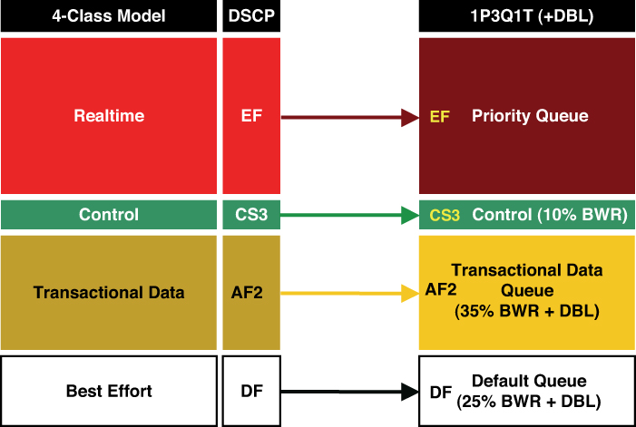
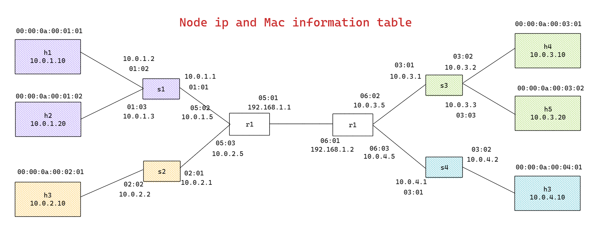
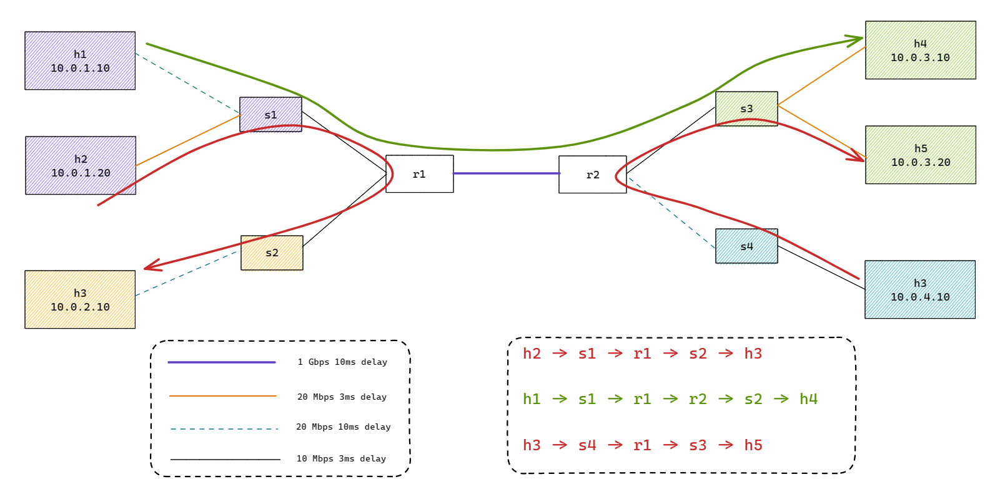

This repository is used to share research experiments based on P4. 

**Install P4utils on a clean Ubuntu 22.03** - this process will take a long time
```
wget -O install-p4-dev.sh https://raw.githubusercontent.com/adaraiseh/p4-routing/refs/heads/master/install-p4-dev.sh
bash install-p4-dev.sh
```

### Introduction ###

This demo shows how to implement a QoS-based IP routers with static routing entries using P4, BMv2 and Mininet. 

The basic functionality of IP router is:

- Determine the output port for packet based on its DSCP value (diffserv) and destination IP (Longest Prefix Match).
- Decrement TTL value for IP protocol
- Update destination MAC address based on next-hop IP address
- Update source MAC address according to output port

For this demo purposes we have adopted 4-class QoS model (1P3Q1T+DBL) illustrated below.  

<p align="center">
  
</p>

Expected runtime queue priorities:  

| DiffServ Code Point | Description               | Priority |
|----------------------|---------------------------|----------|
| `0x2E`              | EF (Expedited Forwarding) | 0        |
| `0x18`              | CS3 (Class Selector 3)    | 1        |
| `0x14`              | AF21 (Assured Forwarding) | 2        |
| `0x16`              | AF22                      | 2        |
| `0x1A`              | AF23                      | 2        |
| Others              | Best Effort               | 3        |

We have implemented the functionality of QoS based IP router as P4 program (router.p4). The program design is as follows:

- We have used V1Model of P4_16 composed of Ingress and Egress control pipelines
- For Ingress control pipeline there is one table defined:
  - **routing_table** - it determines the output port based on IPv4 DiffServ EXACT match and IPv4 dst address LPM. When packet is matched the *ipv4_forward* action is invoked. It sets priority queue based on diffServ value, sets next-hop IP address in the routing_metadata, decrements IPv4 TTL and sets output port.
- For Egress control pipeline we have defined two tables:
  - **switching_table** - it is responsible for setting destination MAC based on next-hop IP address, which is retrieved from routing metadata.
  - **mac_rewriting_table** - it updates source MAC address according to the output port for the packet.

The router.p4 program defines the data plane of IP routers. Note that the control plane in this demo is realized by populating static rules through `controller.py` code.

The structure of the test network is shown below. Each network device has been configured with the **router.p4** program. 

<p align="center">
  
</p>

<p align="center">
  
</p>

### Demo ###

1. First of all you need to setup the environment on your Linux machine.
2. Run the following command to compile P4 programs and run the network.py mininet topology.

`make`

3. In a seprate window run the controller:

`python3 controller.py`

4. In the Mininet console, check if ping between h1 and h2 works

`h1 ping h2`
or `h1 ping h6` etc.

5. To cleanup after run

`make clean`

### TODO ###

1. [P4] Add diffserv to routing_table.
2. [P4/hosts] Implement INT with traffic generator and store results.
3. [network] Expand the network Topo.
4. [controller] Implement RL in controller.